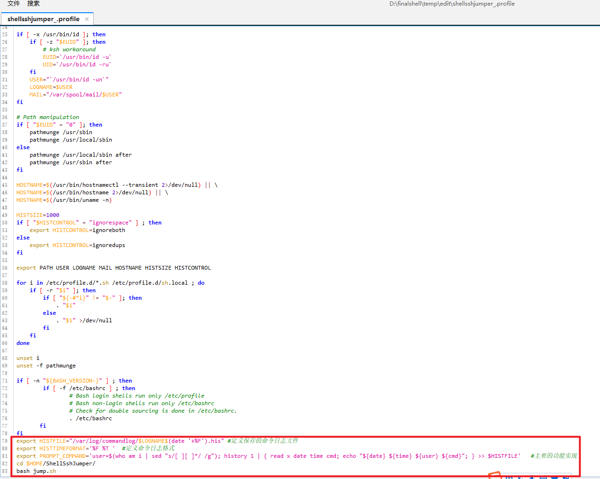

#功能迭代
```

1.解决添加主机不能超过10台的bug

2.实现ssh登录自动运行该脚本

3.实现非root用户不能通过CTRL+C结束脚本进程，root用户可以输入e退出脚本进程

4.实现所有用户双因子验证,且使用不同的验证码

5.实现用户日志记录功能

6.实现list host时按照连接次数进行排序
```


#安装
```
yum install expect git -y

cd /root

git clone https://github.com/mynameiscr7/ShellSshJumper.git
```


#配置日志

```
mkdir -p /var/log/commandlog

chmod a=rwx /var/log/commandlog

vim /etc/profile

#添加如下三行

export HISTFILE="/var/log/commandlog/$LOGNAME$(date '+%F').his" #定义保存的命令日志文件

export HISTTIMEFORMAT='%F %T '  #定义命令日志格式

export PROMPT_COMMAND='user=$(who am i | sed "s/[ ][ ]*/ /g"); history 1 | { read x date time cmd; echo "${date} ${time} ${user} ${cmd}"; } >> $HISTFILE'   #主要的功能实现
```


#远程登录后执行sh脚本

```
vim /etc/profile

#添加如下两行

cd $HOME/ShellSshJumper

bash jump.sh


source /etc/profile
```



#创建用户

```
useradd username

passwd username

su - username

google-authenticator

git clone https://github.com/mynameiscr7/ShellSshJumper.git

```


#删除用户

`userdel -r username`


#配置双因子验证
```
yum install epel-release -y
yum install google-authenticator -y
yum install qrencode-libs -y

google-authenticator

Do you want authentication tokens to be time-based (y/n)  y   #是否启用基于时间的认证
Do you want me to update your "/home/proot/.google_authenticator" file? (y/n)  y   #将认证信息写入到这个文件内
your chances to notice or even prevent man-in-the-middle attacks (y/n)  y        #每次生成的验证码经过30s自动失效
Do you want to do so? (y/n)  n  #如果输入y，可以在4分钟查看8个有效的验证码，如果输入n，可以在一分半中查看三个有效验证码
Do you want to enable rate-limiting? (y/n)  y     #是否启用速率限制，主要是为了防止攻击


#添加谷歌身份验证器PAM模块
#在vi /etc/pam.d/sshd文件第一行添加谷歌身份验证器PAM模块配置：
auth required pam_google_authenticator.so

#或使用如下命令在/etc/pam.d/sshd文件添加认证模块：
echo "auth required pam_google_authenticator.so" >>/etc/pam.d/sshd

vim /etc/ssh/sshd_config
# 将
ChallengeResponseAuthentication no
# 改为
ChallengeResponseAuthentication yes
# 或者
sed -i 's/ChallengeResponseAuthentication no/ChallengeResponseAuthentication yes/g' /etc/ssh/sshd_config

systemctl restart sshd


#其他用户实现双因子
cp /root/.google_authenticator /home/username
chown username:username /home/username/.google_authenticator
或使用
google-authenticator命令重新生成
```

